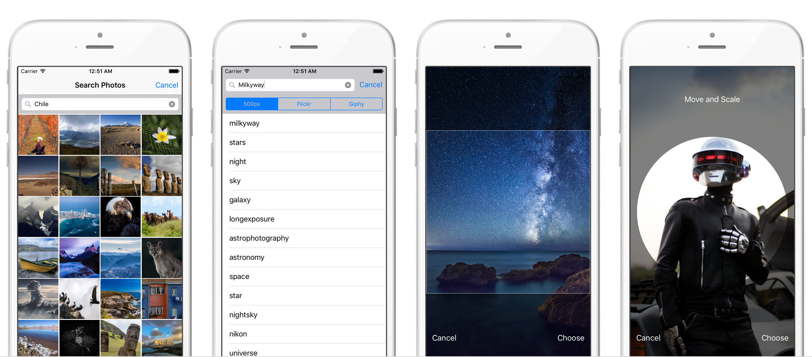

DZNPhotoPickerController
========================
[](https://cocoadocs.org/docsets/DZNPhotoPickerController)
[](http://opensource.org/licenses/MIT)

A photo search/picker for iOS using popular image providers like 500px, Flickr, Instagram, Giphy, Google & Bing Images, combined with a minimalistic image cropper inspired from UIImagePickerController's.




## Feature List
* Search photos on mutiple service providers (500px, Flickr, Giphy, Instagram, Google Images & Bing Images)
* Auto-completed typing for easier search (using Flickr's API as a common denominator).
* Present the photo picker with a pre-defined search term to automatically start searching.
* Exact same UI layouts and behaviours than UIImagePickerController.
* Edit photo selections with cropping guides : square, circular (like the Contacts app) and custom size.
* Cropping mecanism compatible with UIImagePickerController (check on UIImagePickerController+Edit).
* Infinite scrolling (optional).
* Creative Commons licences optional filtering.
* App Store safe. Innapropriate content disabled for all services.
* Option for disabling full sized photo download and retrieving metadata only.
* iOS 8 and 9. iPhone 4/5/6 and iPad support.
* Localization support (UI strings use NSLocalizedString but it's up to you to localize them on your app)
<br>

## Installation

###### With [CocoaPods](https://cocoapods.org/):
```ruby
pod "DZNPhotoPickerController"
```

Dependencies:
- AFNetworking
- SDWebImage
- DZNEmptyDataSet

## How to use
For complete documentation, [visit CocoaPods' auto-generated doc](http://cocoadocs.org/docsets/DZNPhotoPickerController/)

### Import

```
#import <DZNPhotoPickerController/DZNPhotoPickerController.h>
```

### Registration
Before even creating a new instance of DZNPhotoPickerController, it is recommended that you register to the photo services APIs your will need, on your UIViewController's class method +initialize, like so:
```
+ (void)initialize
{
    [DZNPhotoPickerController registerService:DZNPhotoPickerControllerService500px
                                  consumerKey:YOUR_500px_KEY
                               consumerSecret:YOUR_500px_SECRET
                                 subscription:DZNPhotoPickerControllerSubscriptionFree];
    
    [DZNPhotoPickerController registerService:DZNPhotoPickerControllerServiceFlickr
                                  consumerKey:YOUR_Flickr_KEY
                               consumerSecret:YOUR_Flickr_SECRET
                                 subscription:DZNPhotoPickerControllerSubscriptionFree];
}
```

### Initialisation
Creating a new instance of DZNPhotoPickerController is very similar to what you would do with UIImagePickerController:
```
DZNPhotoPickerController *picker = [[DZNPhotoPickerController alloc] init];
picker.supportedServices = DZNPhotoPickerControllerService500px | DZNPhotoPickerControllerServiceFlickr;
picker.allowsEditing = YES;
picker.delegate = self;
    
[self presentViewController:picker animated:YES completion:nil];
````

You can additionally set more properties:
```
picker.initialSearchTerm = @"Surf";
picker.cropMode = DZNPhotoEditorViewControllerCropModeCircular;
picker.enablePhotoDownload = YES;
picker.supportedLicenses = DZNPhotoPickerControllerCCLicenseBY_ALL;
picker.allowAutoCompletedSearch = YES;
picker.infiniteScrollingEnabled = YES;
```

You can opt-in for block methods instead of using the delegate's methods:
```
picker.finalizationBlock = ^(DZNPhotoPickerController *picker, NSDictionary *info) {
    //Your implementation here
};
    
picker.failureBlock = ^(DZNPhotoPickerController *picker, NSError *error) {
    //Your implementation here
};
    
picker.cancellationBlock = ^(DZNPhotoPickerController *picker) {
    //Your implementation here
};
```


## Standalone Image Editor

You can install it as a subspec (if you're not using `DZNPhotoPickerController`)
```
pod 'DZNPhotoPickerController/Editor'
```

If you already have an image to edit, simply do:
```
DZNPhotoEditorViewController *editor = [[DZNPhotoEditorViewController alloc] initWithImage:self.myImage];
editor.cropMode = DZNPhotoEditorViewControllerCropModeCustom;
editor.cropSize = CGSizeMake(CGRectGetWidth(self.view.frame), 200.0);

[editor setAcceptBlock:^(DZNPhotoEditorViewController *editor, NSDictionary *userInfo){
        
    //Your implementation here
}];
    
[editor setCancelBlock:^(DZNPhotoEditorViewController *editor){
        
    //Your implementation here
}];

// The view controller requieres to be nested in a navigation controller
UINavigationController *controller = [[UINavigationController alloc] initWithRootViewController:navigation];
[self presentViewController:controller animated:YES completion:nil];
````

## Circular and Custom Edition
Another great feature of DZNPhotoPickerController is to allow circular edit mode when using UIImagePickerController, just like the Contact app when editing a user's avatar image. *Please note that the circular mode still exports a squared image since it's sole purpose is for croping alignment. If you need to present a circular image in your app, you will need to implement it yourself.*

<br>
Its use is really straightforward:

```
UIImagePickerController *picker = [[UIImagePickerController alloc] init];
picker.allowsEditing = YES;
picker.sourceType = UIImagePickerControllerSourceTypePhotoLibrary;
picker.delegate = self;
picker.cropMode = DZNPhotoEditorViewControllerCropModeCircular;
    
[self presentViewController:picker animated:YES completion:nil];
```

## Block Support
There is also block support for UIImagePickerController! It replaces the 2 traditional delegate methods with 2 block properties instead:
```
picker.finalizationBlock = ^(UIImagePickerController *picker, NSDictionary *info) {
    //Your implementation here
};
    
picker.cancellationBlock = ^(UIImagePickerController *picker) {
     //Your implementation here
};
```


### Sample project
Take a look into the sample project. Everything is there.<br>
The pod dependencies are not being versioned, so before running the project be sure to call:
```
pod install
```

### Collaboration
Feel free to collaborate with this project!
Big thanks to:
- [Greg Knauss](https://github.com/gknauss): Giphy integration.
- [SJ Singh](https://github.com/SJApps): Google Images integration.
- [Felipe Saint-Jean](https://github.com/fsaint): 64bits fix of the editing guides.
- [Adar Porat](https://github.com/aporat) & [Ryan Fitzgerald](https://github.com/ryanfitz): AFNetworking 2.0 upgrade
- [NikDude](https://github.com/nikdude) & [Rob Phillips](https://github.com/iwasrobbed): cool add-ons
- [Curtis Thorne](https://github.com/dirtbikerdude91): Bing Images integration.

## Apps using DZNPhotoPickerController
Are you using this control in your apps? Simply add it here.<br>
- [Slack](https://itunes.apple.com/us/app/id618783545)
- [Epiclist](https://itunes.apple.com/us/app/id789778193/)
- [Everest](https://itunes.apple.com/us/app/id581016826/)
- [Nifti](https://itunes.apple.com/us/app/id703097357)

## License
(The MIT License)

Copyright (c) 2014 Ignacio Romero Zurbuchen <iromero@dzen.cl>

Permission is hereby granted, free of charge, to any person obtaining a copy of this software and associated documentation files (the 'Software'), to deal in the Software without restriction, including without limitation the rights to use, copy, modify, merge, publish, distribute, sublicense, and/or sell copies of the Software, and to permit persons to whom the Software is furnished to do so, subject to the following conditions:

The above copyright notice and this permission notice shall be included in all copies or substantial portions of the Software.

THE SOFTWARE IS PROVIDED 'AS IS', WITHOUT WARRANTY OF ANY KIND, EXPRESS OR IMPLIED, INCLUDING BUT NOT LIMITED TO THE WARRANTIES OF MERCHANTABILITY, FITNESS FOR A PARTICULAR PURPOSE AND NONINFRINGEMENT. IN NO EVENT SHALL THE AUTHORS OR COPYRIGHT HOLDERS BE LIABLE FOR ANY CLAIM, DAMAGES OR OTHER LIABILITY, WHETHER IN AN ACTION OF CONTRACT, TORT OR OTHERWISE, ARISING FROM, OUT OF OR IN CONNECTION WITH THE SOFTWARE OR THE USE OR OTHER DEALINGS IN THE SOFTWARE.
